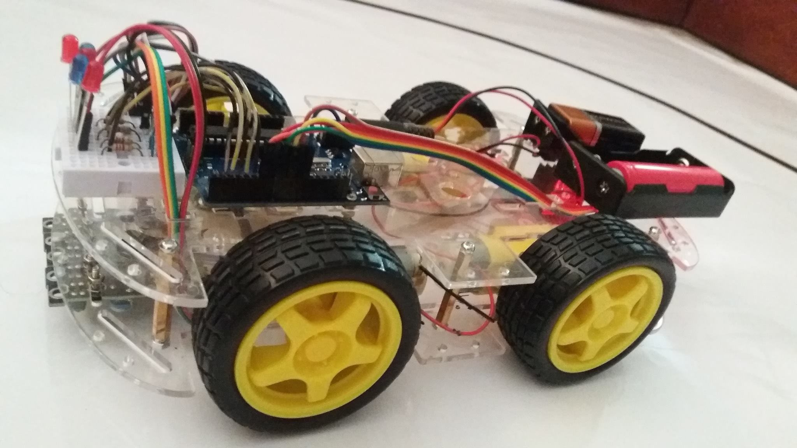
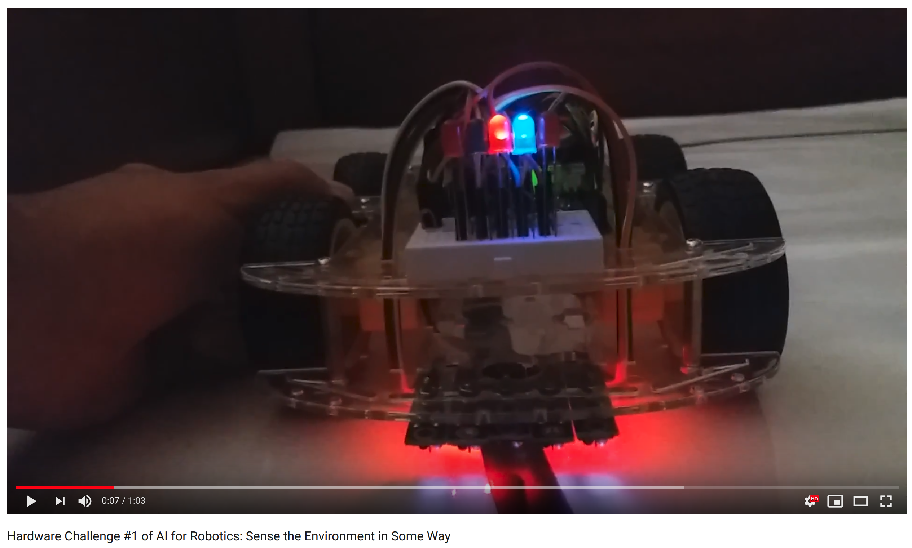
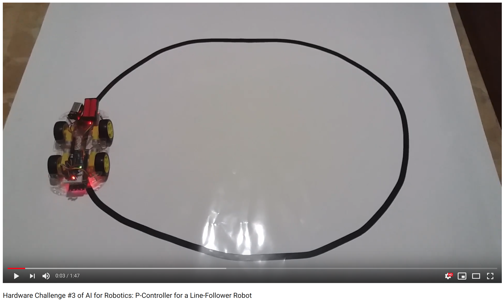

# Line Follower Robot

**SOURCE CODE FOR ARDUINO** 
* motors.ino (Hardware Challenge #2 - Make a Robot Drive in a Controlled Way)
* p_controller.ino (Hardware Challenge #3 - P-Controller for a Line-Follower Robot)

**Hardware Challenge #0 of AI for Robotics** 
Acquire Some Hardware and Describe It

Components-
* 1 transparent chassis of plastic
* 4 motors
* 4 wheels
* L298N motor driver board 
* ARDUINO UNO
* 5 TCRT5000 infrared tubs
* 5 LEDs
* 5 resistors
* 1 mini protoboard
* 2 battery boxes
* 3 batteries
* 1 USB cable for Arduino
* Cables, screws and bolts

**Hardware Challenge #1 of AI for Robotics** 
Sense the Environment in Some Way

The main challenge was to reduce the speed which was done by a dummy circuit to reduce the current flow.

Video Demonstration:

https://youtu.be/YxFP9dMudcE

Video Demonstration:

[ttps://youtube.com/shorts/1f6npEEj3MA?feature=share](https://youtube.com/shorts/1f6npEEj3MA?feature=share)
